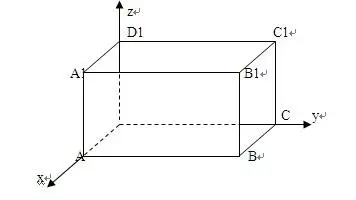

# 立方体翻转 (rotate.c)

## 题目描述



在右手三维坐标系中有一个长方体，底面为矩形 $ABCD$，顶面为矩形 $A_1B_1C_1D_1$，$xOy$ 平面为桌面。

其中 $D$ 与坐标原点重合（图中未标出），$DA$，$DC$，$DD_1$ 分别与 $x$、$y$、$z$ 轴重合。

已知 $DA$、$DC$、$DD_1$ 长度分别为 $a,b,c$。

定义“向右滚动”指长方体以 $BC$ 为轴，旋转 90° 后以 $BCB_1C_1$ 为底面静止桌面上。

相似地，定义“向左滚动”（以 $AD$ 为轴）、“向前滚动”（以 $DC$ 为轴）、“向后滚动”（以 $AB$ 为轴）。

长方体在桌面上滚动若干次后，求长方体底面在 $x,y$ 坐标轴上的投影坐标范围 $x_1, x_2, y_1, y_2(x_1 < x _2, y_1 < y_2)$。

## 输入格式

第一行三个整数 $a, b, c$，表示长方体边长。

第二行一个字符串，由 $WSAD$ 组成，分别表示“向前滚动”，“向后滚动”，“向左滚动”，“向右滚动”。

### 限制与约定

对于 20% 的数据，保证 $a=b=c=1$；

对于 20% 的数据，保证字符串长度为 1；

对于 100% 的数据，保证 $0 < a,b,c < 1000$, 字符串长度不超过 1000。

## 输出格式

一行，用空格隔开的四个整数，$x_1, x_2, y_1, y_2$.

## 示例

### 输入示例1

```text
1 2 3
WD
```

### 输出示例1

```text
-3 0 2 3
```